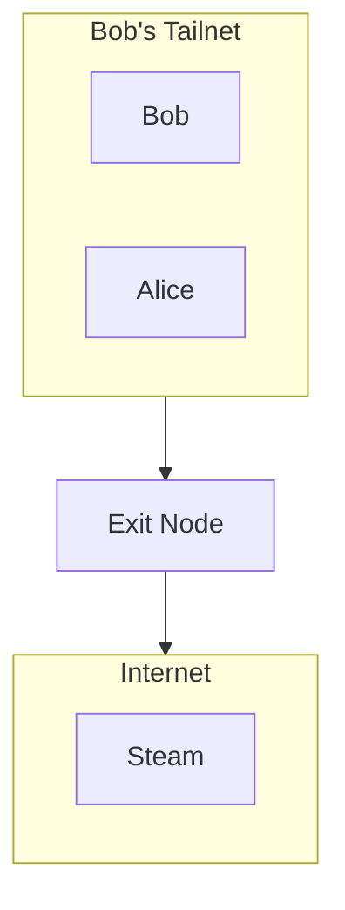

import {ArticleLayout} from '../../../components/layouts/ArticleLayout'
import {createSlug} from '../../../lib/createSlug'
import {metadata as _metadata} from '../../../lib/generateMetadata'
import steamLibrary from './024a06f7b503c5ae8f9442ac521e06b9c9bc21e8.png'
import Image from 'next/image'

export const meta = {
    authors: 'Ryan Freeman',
    title: 'Using Tailscale to bypass Steam Families restrictions',
    date: '2024-09-14',
    description: 'This past week, Steam launched Steam Families, which allows Steam account owners to share their game library with up to six members of their family.'
}

export const metadata = _metadata({title: meta.title, heading: meta.title, description: meta.description, type: 'article'})

export default (props) => <ArticleLayout
    title={meta.title}
    date={meta.date}
    description={meta.description}
    slug={createSlug(meta.title)}
    {...props} />

<Image src={steamLibrary} alt=""/>

This past week, Steam launched [Steam Families](https://store.steampowered.com/news/app/593110/view/4149575031735702628), which allows Steam account owners to share their game library with up to six members of their family.

However, while adding one of my family members, I discovered that they must be on the same network as the family organiser to reap the benefits of this new feature.

In this post, I'll talk about how I used Tailscale to overcome this geoblocking restriction.

## What is Tailscale?

[Tailscale](https://tailscale.com/) is a free VPN solution that creates secure encrypted, peer-to-peer connections between your devices. It's built on top of WireGuard, and [is easy to set up and configure](https://tailscale.com/kb/1017/install).

Tailscale allows devices to communicate and share resources securely as if they were on the same local network, regardless of where they are physically located in the world.

Devices connected within your Tailscale network are part of a tailnet, we'll be taking advantage of a Tailscale feature and configuring one of the devices as an exit node.

## What is an exit node?

Any device in your tailnet can be configured to act as an [exit node](https://tailscale.com/kb/1103/exit-nodes), which means all traffic will be routed through that node. For example, let's say Bob wants to allow Alice to route all her traffic through Bob's tailnet.

Bob simply [configures a device in the tailnet as an exit node](https://tailscale.com/kb/1103/exit-nodes#configure-an-exit-node), and upon joining Bob's tailnet, Alice can route [all her traffic through Bob's exit node](https://tailscale.com/kb/1103/exit-nodes#use-the-exit-node).

Websites and apps that Alice visits will now appear to come from Bob's IP address, for as long as she is using Bob's tailnet and exit node.

## Sounds great, does it actually work?

Yes! After setting up the exit node and inviting my family member to the tailnet, he was able to route all his traffic through the exit node and finally activate his membership in my Steam Families group.

## Does it work for other services?

Yes! This concept works for other services too. For example, while abroad I was able to access streaming services and watch content from my home country that normally wouldn't be available in the country I was in.

## Conclusion

In this post, I talked about how I used a free VPN solution called Tailscale to bypass Steam Families geoblocking restriction.

However, it's important to note that this may violate the Terms of Service, and it's unclear how frequently Steam verifies members of Steam Families.
